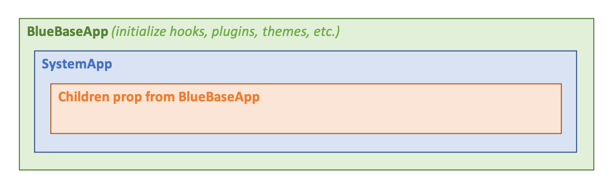

# ⛩ Main App Layout

BlueBase . It is just a React Component, and can either be used as the top most component of your project or it can be embedded in your existing code base.

This component takes care of initialisation and renders the `SystemApp` component.&#x20;

.png>)

If children prop is provided, then it renders the children prop instead of the Main App Layout.

