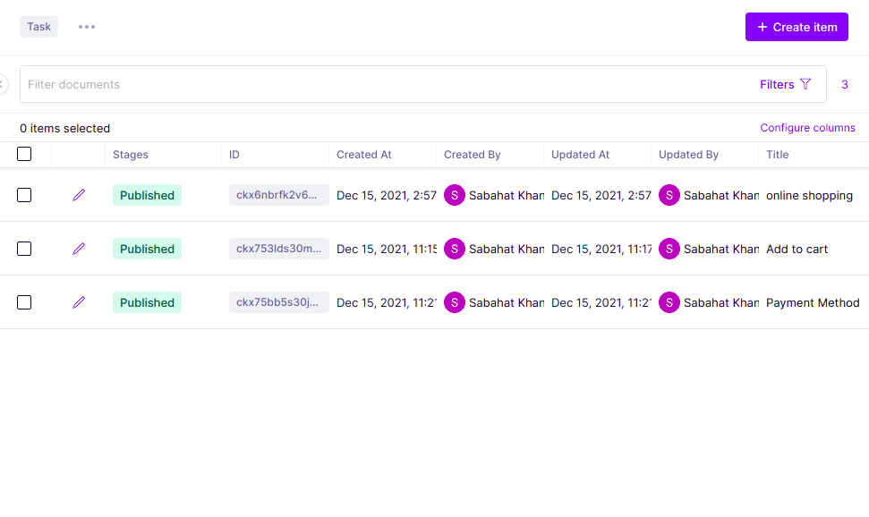

# 1. Create a Backend API

We need to create a backend graphql API for our Travel app.

Add GraphCMS steps.

1. Signup on GraphCMS to create a GraphQL api.
2. Create a new project
3. Select "From Template"
4. Select "ToDo App"&#x20;
5. Enter name and description, keep "Include template content" checked
6. Press Create
7. On the  "Please choose a plan" dialog, select "Developer" and press "Continue"

## **After creating Project**


### 1. Set up your schema


Define the building blocks of your content that will shape your editing interface and API.

### Setup Graphql typings in client

### 2. **Create Content**

Step 1: Install following dev dependencies:

Use the intuitive editing interface to fill your project with content.

```shell
yarn add @graphql-codegen/cli @graphql-codegen/typescript @graphql-codegen/typescript-operations graphql --dev
```

### 3. **Make your API accessible**

Step 2: Add following script to the script section of your package.json file:

Open up your API to the public or create secure tokens to access your API from the outside.

```
  "graphql-codegen": "graphql-codegen && prettier ./src/graphql/types.ts  --write",
```

### **4. Integrate your content into your applications**

Step 3: Create a file `codegen.yml` in the root directory:

Learn how to fetch content with GraphQL, using the interactive API Playground.

```
name: GraphQL API
schema: [[graphql-url]]
generates:
  ./src/graphql/types.ts:
    plugins:
      - typescript
      - typescript-operations

```

### &#x20; 5. **For test query click on API Playground**&#x20;

Replace `[[graphql-url]]` with the url of your graphql api.

## &#x20;**ScreenShots**

Step 4: Generate code

&#x20;.png>)                         ****                         .png>).png>)                     .png>).png>)                       .png>) (1).png>)                       .png>).png>)                       

Run command `yarn graphql-codegen` on your terminal. This should create a file at `./src/graphql/types.ts`



