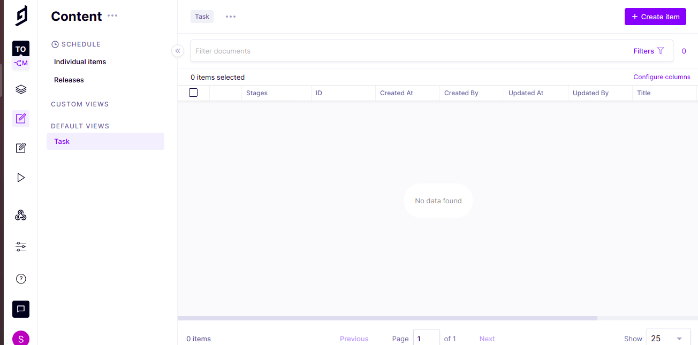
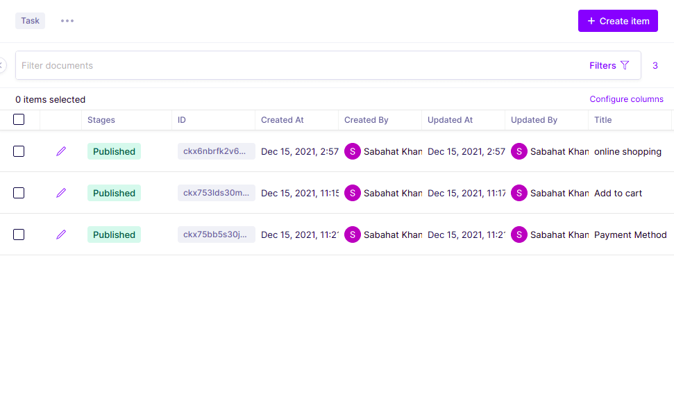

# 1. Create a Backend API

We need to create a backend graphql API for our Travel app.

1. Signup on GraphCMS to create a GraphQL api.
2. Create a new project
3. Select "From Template"
4. Select "ToDo App"&#x20;
5. Enter name and description, keep "Include template content" checked
6. Press Create
7. On the  "Please choose a plan" dialog, select "Developer" and press "Continue"

## **After creating Project**

### 1. Set up your schema

Define the building blocks of your content that will shape your editing interface and API.

### 2. **Create Content**

Use the intuitive editing interface to fill your project with content.

### 3. **Make your API accessible**

Open up your API to the public or create secure tokens to access your API from the outside.

### **4. Integrate your content into your applications**

Learn how to fetch content with GraphQL, using the interactive API Playground.

### &#x20; 5. **For test query click on API Playground**&#x20;

## &#x20;**ScreenShots**

&#x20;.png>)                         ****                         .png>).png>)                     .png>).png>)                       .png>) (1).png>)                       .png>).png>)                       

