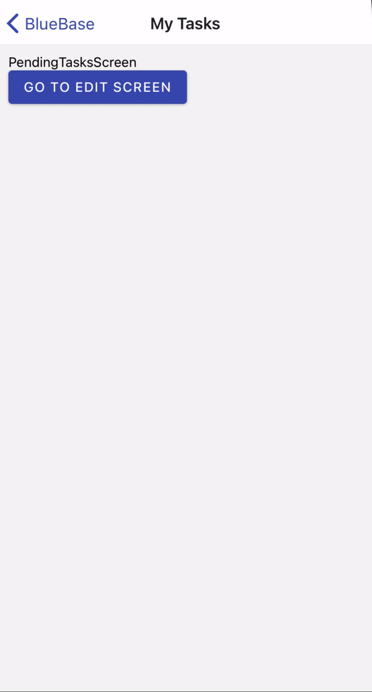

# 3.2 Edit Task Screen

### New Screens

* CreateTaskScreen
* EditTaskScreen
* PendingTasksScreen

### Adding Edit Route


```typescript
routes: [{
	name: 'EditTask',
	screen: 'EditTaskScreen',
	path: ':taskId',
	exact: true,

	options: {
		title: 'Edit Task',
	},
},
{
	name: 'TasksApp',
	screen: 'PendingTasksScreen',
	path: '',
	exact: false,

	options: {
		title: 'My Tasks',
	},
}]
```


URL: [http://localhost:19006/p/tasks/123](http://localhost:19006/p/tasks/123)

 


```typescript
import { useNavigation } from '@bluebase/core';
import React from 'react';
import { Text, View } from 'react-native';

export const EditTaskScreen = () => {
	const { getParam } = useNavigation();
	const taskId = getParam('taskId', null);

	return (
		<View style={{ padding: 10 }}>
			<Text>EditTaskScreen: {taskId}</Text>
		</View>
	);
};

EditTaskScreen.displayName = 'EditTaskScreen';
```



 

