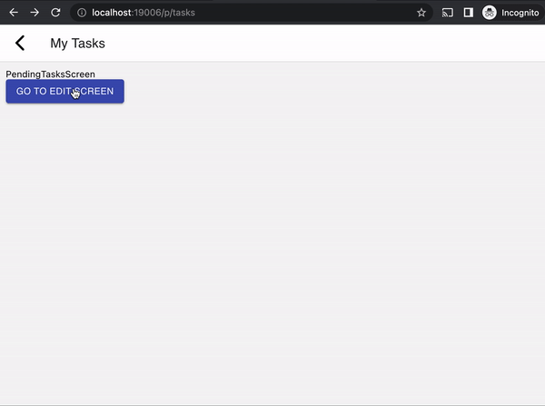
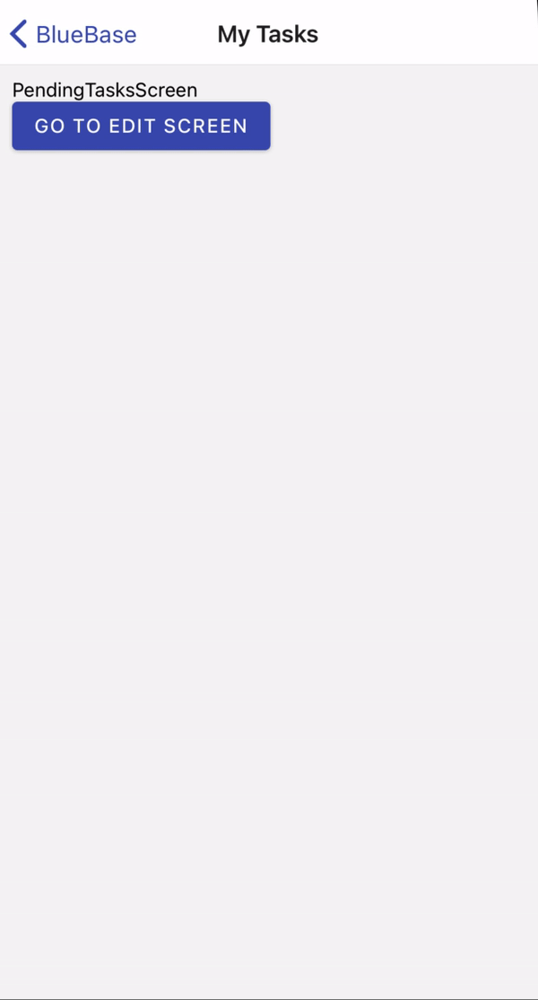

# 3.2 Edit Task Screen

Next up, we are going to create a screen that will allow a user to edit a task.

### Step 1: New Screens

Before we move forward to adding new routes, let's quickly create 3 copies of our `PendingTasksScreen` component, and give them the following names:

* CreateTaskScreen
* EditTaskScreen
* CompletedTasksScreen

So now we should have 4 screens in total.

### Step 2: Adding Edit Route

Add the following `EditTask` route to the `routes` array:


```typescript
routes: [{
	name: 'EditTask',
	screen: 'EditTaskScreen',
	path: 't/:taskId',
	exact: true,

	options: {
		title: 'Edit Task',
	},
},
{
	name: 'TasksApp',
	screen: 'PendingTasksScreen',
	path: '',
	exact: false,

	options: {
		title: 'My Tasks',
	},
}]
```


This should create the second route, which should be accessible via the following URL:

```
http://localhost:19006/p/tasks/t/123
```

### Step 3: Create a Button to Navigate

But we still need a way to navigate to this route in our UI. Let's modify our `PendingTasksScreen` component to add a button:

```typescript
import { Button, View } from '@bluebase/components';
import { useNavigation } from '@bluebase/core';
import React, { useCallback } from 'react';
import { Text } from 'react-native';

export const PendingTasksScreen = () => {
	const { push } = useNavigation();

	const goToEdit = useCallback(() => {
		push('EditTask', { taskId: '123' });
	}, []);

	return (
		<View>
			<Text>PendingTasksScreen</Text>
			<Button title="Go To Edit Screen" onPress={goToEdit} />
		</View>
	);
};

PendingTasksScreen.displayName = 'PendingTasksScreen';
```

Notice, that we use the `push` method from BlueBase's `useNavigation` hook. The method takes route name and optional params object as its arguments.

Run your app, you should now be able to navigate between routes.

 

### Step 4: Extract Route Param

Notice that the value of path property in the route is `:taskId`. This means that any value that is entered in this part of the URL will be captured in the `taskId` param. For example the URL `http://localhost:19006/p/tasks/123` will extract value `123` in the `taskId` variable.&#x20;

Let's see how we can use this value, modify the `EditTaskScreen` component to match the following content:


```typescript
import { useNavigation } from '@bluebase/core';
import React from 'react';
import { Text, View } from 'react-native';

export const EditTaskScreen = () => {
	const { getParam } = useNavigation();
	const taskId = getParam('taskId', null);

	return (
		<View style={{ padding: 10 }}>
			<Text>EditTaskScreen: {taskId}</Text>
		</View>
	);
};

EditTaskScreen.displayName = 'EditTaskScreen';
```


Notice the code on Line 7, we use the `getParam` function to extract the URL param.

 
