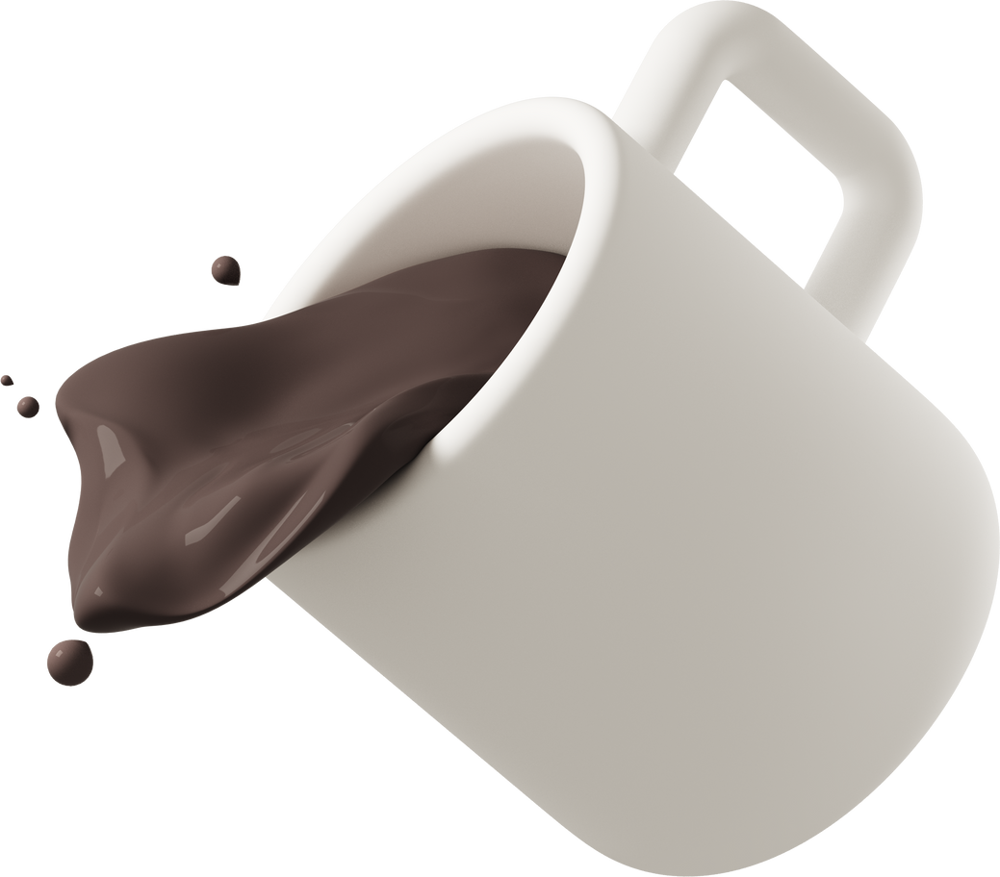

# Assets


## Using Dark/Light Mode Specific Images

 


```
/* eslint-disable camelcase */
import { createPlugin } from '@bluebase/core';

import { ToDoAppIcon } from './components/ToDoAppIcon';
import { filters } from './filters';
import { lang } from './lang';
import { routes } from './routes';
import { screens } from './screens';

export default createPlugin({
	key: 'tasks',
	name: 'Tasks',
	description: 'A todo app made with BlueBase framework.',

	assets: {
		NoTasks_dark: require('../assets/no-tasks-dark.png'),
		NoTasks_light: require('../assets/no-tasks-light.png'),
	},

	// ... Other properties
});

```


```jsx
<ComponentState
    title={__('No tasks')}
    imageProps={{ resizeMode: 'contain' }}
    description={__('Start by creating a new task')}
    imageSource="NoTasks"
    actionTitle={__('Create Task')}
    actionOnPress={goToCreate}
    actionProps={{ size: 'small', color: 'success', variant: 'outlined' }}
    {...props}
/>
```


 

 


```
NoTasks
NoTasks_dark
NoTasks_light
NoTasks_desktop
NoTasks_mobile
NoTasks_desktop_dark
NoTasks_mobile_dark
NoTasks_desktop_light
NoTasks_mobile_light
```
