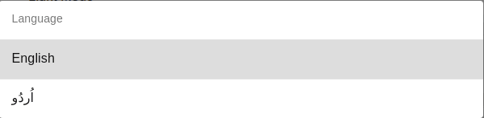

# 6. Translating your App in other languages

Our application can get translated into other languages. This feature provides our application an edge in the market making it usable worldwide. People from different parts of the world will be able to use the application by changing the language in settings as per convenience. This feature can be viewed in the settings as:

In language settings, We can add two languages Urdu and English to our application.

